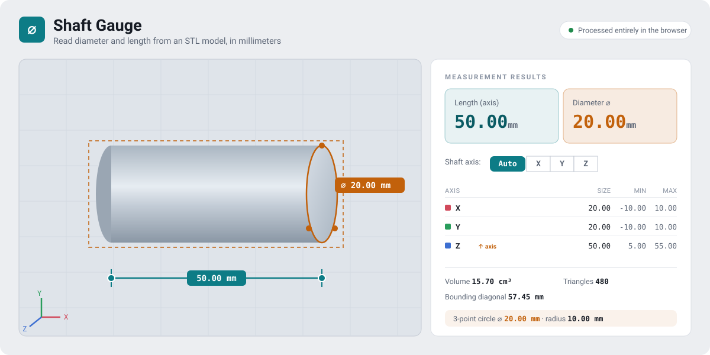

# Shaft Gauge — Measure From STL

[](https://emresensoy.github.io/MeasureFromSTL/)
[](LICENSE)


A single-file, browser-based tool for reading dimensions off an **STL** mesh. Load a
model and get **diameter** and **length** in millimeters, measure the **distance between
two points**, or fit a **circle through three points**. Everything runs locally in the
browser — the file never leaves your device.

**▶ Live demo: https://emresensoy.github.io/MeasureFromSTL/**



> *Interface preview (illustration). To drop in a real screenshot, replace `docs/preview.svg`.*

## Features

- **Drag & drop** an STL file (binary *and* ASCII formats supported).
- **Bounding box** dimensions — X / Y / Z size, min and max per axis.
- **Diameter & length** — automatic shaft-axis detection, or pick the axis manually (Auto / X / Y / Z).
- **Point-to-point distance** — click two points; shows the 3D distance plus ΔX / ΔY / ΔZ components.
- **3-point circle** — click three points on a round feature (bore, shaft cross-section) to fit a circle and read its **diameter, radius, and circumference** — works on tilted planes.
- **2D cross-section** — slice the model on the **XY / XZ / YZ** plane with a movable slider; read the section's **width × height** and measure on the contour (distance and 3-point circle).
- **Vertex snapping** — the cursor snaps to nearby mesh vertices for precise edge/corner picks.
- **Interactive 3D view** — drag to rotate, mouse wheel to zoom; dashed bounding box and axis triad for orientation.
- **Extras** — mesh volume, bounding diagonal, triangle count.
- Light/dark theme aware, fully offline, no installation.

## Usage

1. Use the **[live demo](https://emresensoy.github.io/MeasureFromSTL/)**, or open **`index.html`** locally in any modern browser (double-click the file — no server needed).
2. Drag an `.stl` file onto the stage, or click **Choose file**.
3. Read the results in the right-hand panel. Rotate the model by dragging; zoom with the wheel.
4. To measure by hand:
   - Click **📐 Distance**, then click two points.
   - Click **⌀ Circle**, then click three points around a round feature.
   - Click **✂ Section** to slice the model: pick the plane (XY / XZ / YZ), drag the slider to move the cut, and read the section's width × height. Distance/Circle picks snap to the section contour while sectioning is active.
   - **Clear** resets the current picks. Clicking a mode button again exits that mode.

> **Tip:** for the most accurate bore/shaft diameter, spread the three circle points roughly
> 120° apart around the circumference rather than clustering them together.

## How the measurements work

- **Diameter (auto):** each vertex's radial distance from the selected axis is computed; the
  main value is the **99th percentile** (rejects surface noise/outliers), while **max ⌀** is
  the farthest point. Reliable for cylindrical parts — for irregular geometry, use the
  bounding-box dimensions instead.
- **Length:** the extent of the model along the selected (or longest) axis.
- **Point-to-point:** straight-line 3D distance between the two picked points.
- **3-point circle:** the unique circumscribed circle through the three points, solved in 3D
  (independent of orientation). Collinear points are detected and reported as invalid.
- **Volume:** signed-tetrahedron sum over all triangles (accurate for closed/watertight meshes).

## ⚠️ Unit note

STL files are **unitless**. Values are read without scaling and assumed to be in **mm**
(the CAD convention). If your model was built in cm or inches, convert the results accordingly.

## Files

| File | Description |
|------|-------------|
| `index.html` | The complete tool — self-contained, open directly in a browser or via the live demo. |
| `test_geom.py` | Validates the diameter / length / volume math against a synthetic cylinder. |
| `test_circle.py` | Validates the 3-point circle fit against a known tilted circle. |
| `docs/preview.svg` | Interface preview used in this README. |
| `LICENSE` | MIT license. |

## Tests

The geometry math is verified with two standalone Python scripts (no dependencies):

```bash
python test_geom.py
python test_circle.py
```

`test_geom.py` builds a ⌀20 × 50 mm cylinder and confirms length = 50.000, diameter = 20.000,
and volume ≈ analytical value. `test_circle.py` reconstructs a known circle (center and radius)
from three points on a tilted plane and confirms collinear points are rejected.

## Limitations

- Diameter estimation assumes a roughly cylindrical part; stepped/multi-diameter shafts
  should be measured section by section (use the 3-point circle at each step).
- Vertex-snap preview is disabled on very large meshes (> 45,000 triangles) for performance;
  click-picking still works.
- Volume assumes a closed mesh; open or non-manifold meshes give approximate values.
- Google Fonts are used for typography; offline they fall back to system fonts (no effect on function).

## Privacy

All parsing and computation happen in the browser. No file is uploaded, and no network
request is made for the model data.

## License

Released under the [MIT License](LICENSE) © 2026 Emre ŞENSOY.
